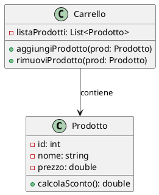
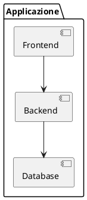
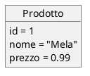
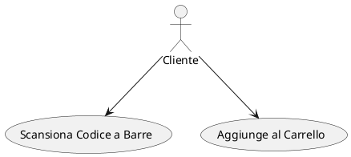
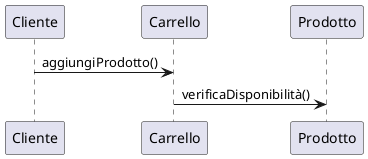
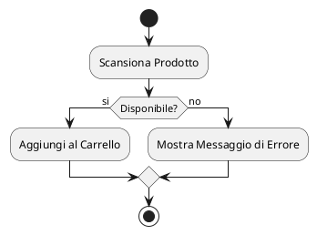

### Guida: I Diagrammi UML

L'Unified Modeling Language (UML) è un linguaggio visivo standard utilizzato per la progettazione e documentazione di sistemi software complessi. È uno strumento essenziale per rappresentare le diverse prospettive di un sistema, dal comportamento degli oggetti al flusso delle operazioni, e viene utilizzato nelle fasi di analisi e progettazione del ciclo di sviluppo del software.

In questa guida, esploreremo i principali diagrammi UML e il loro utilizzo.

---

## 1. **Tipologie di Diagrammi UML**

I diagrammi UML si dividono in due grandi categorie:

- **Diagrammi Strutturali**: rappresentano l'architettura statica del sistema, ossia la sua struttura.
- **Diagrammi Comportamentali**: rappresentano il comportamento dinamico del sistema e delle interazioni tra gli oggetti.

---

### 1.1 **Diagrammi Strutturali**

#### 1.1.1 Diagramma delle Classi
Il **Diagramma delle Classi** è il diagramma UML più comune. Rappresenta le classi del sistema, i loro attributi, metodi e le relazioni tra di esse (come associazioni, eredità, composizione).

##### Elementi Principali:
- **Classi**: Rettangoli che contengono tre sezioni: nome della classe, attributi e metodi.
- **Associazioni**: Linee che collegano le classi per rappresentare le relazioni tra di esse.
- **Ereditarietà**: Una freccia vuota che punta alla classe madre.
- **Composizione/Aggregazione**: Un rombo pieno/vuoto che indica che una classe è composta da altre classi (parte-tutto).

##### Esempio:

#### 1.1.2 Diagramma dei Componenti
Il **Diagramma dei Componenti** rappresenta le diverse parti del sistema (componenti software) e le loro interazioni. Viene utilizzato per descrivere la suddivisione modulare del sistema in componenti indipendenti.

##### Elementi Principali:
- **Componenti**: Rappresentati come rettangoli con due piccole "lame" su un lato.
- **Interfacce**: Frecce che indicano come i componenti interagiscono tra di loro.

##### Esempio:

#### 1.1.3 Diagramma degli Oggetti
Il **Diagramma degli Oggetti** è simile al diagramma delle classi ma rappresenta le **istanze** di classi (oggetti) in un dato momento, insieme ai loro valori specifici.

##### Esempio:

---

### 1.2 **Diagrammi Comportamentali**

#### 1.2.1 Diagramma dei Casi d’Uso
Il **Diagramma dei Casi d’Uso** descrive le funzionalità del sistema dal punto di vista dell’utente. È utile durante la fase di raccolta dei requisiti.

##### Elementi Principali:
- **Attori**: Rappresentano utenti o sistemi esterni che interagiscono con il sistema.
- **Casi d’uso**: Ovali che rappresentano le funzionalità offerte dal sistema.
- **Relazioni**: Frecce che collegano attori e casi d’uso, indicandone le interazioni.

##### Esempio:

#### 1.2.2 Diagramma di Sequenza
Il **Diagramma di Sequenza** rappresenta l'ordine temporale delle interazioni tra oggetti o componenti nel sistema, utile per capire il flusso di eventi.

##### Elementi Principali:
- **Attori/Oggetti**: Rappresentati come rettangoli nella parte superiore del diagramma.
- **Lifeline**: Linee verticali sotto ogni attore/oggetto che mostrano la loro esistenza durante la sequenza.
- **Messaggi**: Frecce che indicano la comunicazione tra attori/oggetti.

##### Esempio:

#### 1.2.3 Diagramma di Attività
Il **Diagramma di Attività** descrive il flusso di controllo tra le varie attività nel sistema. È utile per modellare processi aziendali o algoritmi complessi.

##### Elementi Principali:
- **Attività**: Rettangoli arrotondati che indicano azioni o operazioni.
- **Decisioni**: Diamanti che rappresentano scelte multiple.
- **Flusso**: Frecce che collegano le attività e mostrano la sequenza.

##### Esempio:

---

### 2. **Come Creare Diagrammi UML**

Esistono diversi strumenti per creare diagrammi UML, tra cui:

- **PlantUML**: Un tool che permette di scrivere il diagramma in formato testuale e poi generare il diagramma visivo.
- **StarUML**: Un editor grafico potente e facile da usare per creare diagrammi UML.
- **Lucidchart**: Uno strumento online per creare diagrammi, che supporta UML.

---

### 3. **Utilizzo dei Diagrammi UML nelle Diverse Fasi di Sviluppo**

#### 3.1 Fase di Analisi
Durante l’analisi, i diagrammi UML (come i casi d’uso) vengono utilizzati per comprendere le funzionalità richieste e modellare le interazioni tra gli utenti e il sistema.

#### 3.2 Fase di Progettazione
In questa fase, i diagrammi delle classi, degli oggetti e dei componenti aiutano a definire l'architettura del sistema e a rappresentare la struttura del codice.

#### 3.3 Fase di Implementazione
Durante l'implementazione, i diagrammi di sequenza e di attività vengono utilizzati per descrivere il flusso delle operazioni e per chiarire l'ordine in cui le azioni devono avvenire.

---

### 4. **Best Practices per l’Uso dei Diagrammi UML**

- **Semplicità**: Mantieni i diagrammi semplici e chiari. Troppi dettagli possono rendere difficile la comprensione.
- **Coerenza**: Usa convenzioni coerenti in tutto il progetto, come la stessa nomenclatura e stile per rappresentare classi e relazioni.
- **Focalizzazione**: Utilizza il diagramma giusto per il problema che stai affrontando. Non è necessario usare tutti i tipi di diagrammi UML per ogni progetto.
- **Aggiornamento**: Mantieni i diagrammi aggiornati man mano che il progetto evolve. Diagrammi obsoleti possono creare confusione nel team.

---

### 5. **Conclusione**

I diagrammi UML sono uno strumento potente per visualizzare, documentare e progettare sistemi software. Comprendere come e quando utilizzarli è essenziale per creare una documentazione chiara e per comunicare le soluzioni architetturali in modo efficace.

---

[INDICE](README.md)