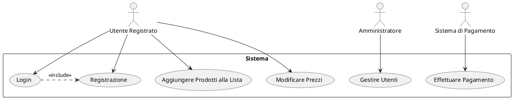

### Guida: **Diagrammi dei Casi d'Uso**

I **diagrammi dei casi d'uso** sono uno strumento fondamentale dell'**UML** (Unified Modeling Language) per descrivere l'interazione tra un sistema e gli utenti o attori esterni. Questi diagrammi aiutano a rappresentare graficamente i requisiti funzionali di un sistema, evidenziando cosa può fare un utente e quali funzionalità del sistema sono a disposizione.

---

## 1. **Cos'è un Caso d'Uso?**

Un **caso d'uso** è una descrizione di un'interazione specifica tra un utente (attore) e un sistema per raggiungere un obiettivo particolare. Ogni caso d'uso descrive una sequenza di azioni che producono un risultato di valore per l'utente.

### 1.1 Elementi Principali di un Caso d'Uso:
- **Attore**: Un utente o sistema esterno che interagisce con il sistema in questione. Gli attori possono essere umani, software, o altri sistemi.
- **Caso d'Uso**: Una funzionalità o servizio offerto dal sistema che permette agli attori di raggiungere i loro obiettivi.
- **Sistema**: Il contesto all'interno del quale avvengono le interazioni tra gli attori e i casi d'uso.

---

## 2. **Componenti di un Diagramma dei Casi d'Uso**

Un diagramma dei casi d'uso contiene diversi componenti chiave, tra cui:

### 2.1 Attori
- Gli attori sono rappresentati con figure stilizzate (omino) e rappresentano chi interagisce con il sistema. Possono essere:
  - **Utenti**: Come un cliente, un amministratore, un gestore.
  - **Altri Sistemi**: Come un servizio esterno o una base di dati.

### 2.2 Casi d'Uso
- I casi d'uso sono rappresentati da ovals (ovali) e rappresentano azioni o funzionalità che il sistema offre agli attori. Esempi:
  - Registrazione utente
  - Acquisto di un prodotto
  - Gestione della lista della spesa

### 2.3 Relazioni
- **Associazione**: Una linea semplice che collega un attore a un caso d'uso, indicante che l'attore interagisce con quel caso d'uso.
- **Generalizzazione**: Una freccia vuota che punta dall'attore più specifico a quello più generico o tra due casi d'uso. Indica una relazione di ereditarietà.
- **Include**: Una freccia tratteggiata con <<include>>, che rappresenta un'azione obbligatoria da eseguire come parte del caso d'uso.
- **Extend**: Una freccia tratteggiata con <<extend>>, che rappresenta un comportamento opzionale aggiunto a un caso d'uso principale.

---

## 3. **Come Creare un Diagramma dei Casi d'Uso**

### 3.1 Passi per la Creazione
1. **Identifica gli attori**:
   - Chi sono gli utenti o i sistemi che interagiscono con il sistema? 
   - Suddividili in attori principali (utenti diretti) e attori secondari (altri sistemi o ruoli).
   
2. **Definisci i casi d'uso**:
   - Quali sono le funzionalità principali che il sistema deve fornire?
   - Assicurati che ogni caso d'uso rappresenti un obiettivo chiaro e un risultato utile per l'attore.

3. **Crea le relazioni**:
   - Collega gli attori ai casi d'uso con le linee di associazione.
   - Se ci sono dipendenze tra i casi d'uso (inclusione o estensione), rappresentale con le appropriate relazioni <<include>> o <<extend>>.

4. **Organizza il sistema**:
   - Definisci il **sistema** in un rettangolo che circonda tutti i casi d'uso, ma lascia gli attori fuori dal rettangolo.

### 3.2 Esempio di Diagramma dei Casi d'Uso

Immagina di creare un diagramma per un sistema di gestione di una **lista della spesa**:

#### Attori:
- **Utente Registrato**
- **Amministratore**
- **Sistema di Pagamento**

#### Casi d'Uso:
- **Registrazione**
- **Login**
- **Aggiungere Prodotti alla Lista**
- **Modificare Prezzi**
- **Effettuare Pagamento**

#### Relazioni:
- Il **Login** include il caso d'uso **Registrazione** (se l'utente non è registrato).
- L'**Utente Registrato** può interagire con i casi d'uso **Aggiungere Prodotti alla Lista** e **Modificare Prezzi**.
- Il **Sistema di Pagamento** interagisce con il caso d'uso **Effettuare Pagamento**.

---

## 4. **Strumenti per Creare Diagrammi dei Casi d'Uso**

### 4.1 Strumenti Online
- **Lucidchart**: Uno strumento di creazione diagrammi online facile da usare.
- **Draw.io**: Uno strumento gratuito che supporta la creazione di diagrammi UML.
- **Creately**: Permette la collaborazione per creare diagrammi UML online.

### 4.2 Strumenti Specifici UML
- **StarUML**: Un tool dedicato alla modellazione UML, supporta la creazione di diagrammi complessi.
- **Visual Paradigm**: Ottimo per diagrammi UML e modellazione software.
- **PlantUML**: Un tool testuale per creare diagrammi UML utilizzando un linguaggio descrittivo semplice.

---

## 5. **Esempio di Codice PlantUML per un Diagramma dei Casi d'Uso**

---

## 6. **Buone Pratiche per i Diagrammi dei Casi d'Uso**

- **Chiarezza**: Mantieni il diagramma semplice e leggibile. Non sovraccaricare il diagramma con troppi dettagli.
- **Focus sui ruoli**: Definisci chiaramente gli attori e i loro ruoli nel sistema.
- **Modularità**: Se il sistema è complesso, crea diagrammi dei casi d'uso separati per diverse parti del sistema.
- **Iterazione**: Aggiorna il diagramma man mano che i requisiti evolvono durante lo sviluppo.

---

## 7. **Conclusione**

I diagrammi dei casi d'uso sono uno strumento essenziale per comprendere e comunicare le funzionalità di un sistema, ponendo l'accento sull'interazione tra attori e sistema. Utilizzando questi diagrammi, è possibile definire chiaramente i requisiti funzionali, migliorare la comunicazione tra il team di sviluppo e gli stakeholder, e fornire una visione chiara delle funzionalità chiave che il sistema deve supportare.

---

[INDICE](README.md)