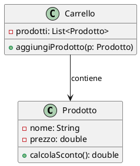
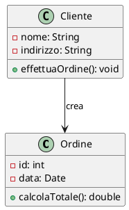
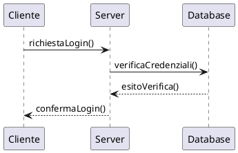
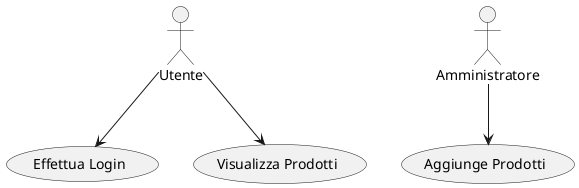
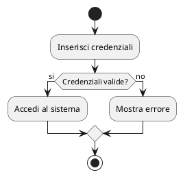
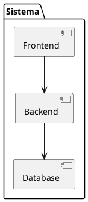
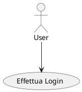

### Guida: PlantUML

**PlantUML** è uno strumento che permette di creare diagrammi UML (Unified Modeling Language) usando un linguaggio testuale semplice. Questo approccio facilita la generazione di diagrammi UML di vario tipo, senza dover utilizzare un'interfaccia grafica. È utilizzato in molteplici contesti, specialmente in ambienti DevOps e documentazione tecnica.

---

## 1. **Installazione di PlantUML**

PlantUML può essere utilizzato sia localmente che tramite strumenti online. Ecco i passi per installarlo sul proprio sistema o utilizzarlo tramite altre piattaforme.

### 1.1 Utilizzo Online
Puoi generare diagrammi PlantUML senza installare nulla utilizzando servizi online come:

- **PlantUML Online Editor**: [https://www.plantuml.com/plantuml/uml](https://www.plantuml.com/plantuml/uml)
- **Editor basati su browser** come Lucidchart, Visual Paradigm, o IntelliJ con il plugin PlantUML integrato.

### 1.2 Installazione Locale
Puoi installare PlantUML sul tuo computer seguendo questi passi:

1. **Prerequisiti**:
   - **Java**: PlantUML richiede Java per funzionare. Assicurati di avere Java installato:
     ```bash
     java -version
     ```
   - **Graphviz**: PlantUML richiede Graphviz per generare i grafici. Puoi installarlo con:
     - Su **Ubuntu/Debian**:
       ```bash
       sudo apt-get install graphviz
       ```
     - Su **MacOS** (con Homebrew):
       ```bash
       brew install graphviz
       ```
   
2. **Download di PlantUML**:
   - Scarica PlantUML dal sito ufficiale: [http://plantuml.com/download](http://plantuml.com/download).
   - PlantUML è un file `.jar`, quindi può essere eseguito con:
     ```bash
     java -jar plantuml.jar file_diagramma.txt
     ```

### 1.3 Plugin per Editor di Testo
PlantUML può essere integrato nei più comuni editor di codice:
- **VSCode**: Installa l'estensione "PlantUML" da Marketplace.
- **IntelliJ IDEA**: Installa il plugin "PlantUML Integration".
- **Sublime Text**: Usa il pacchetto PlantUML con Package Control.

---

## 2. **Sintassi Base di PlantUML**

PlantUML utilizza una sintassi semplice e diretta per definire diagrammi. Vediamo alcune basi della sintassi e come generare i vari tipi di diagrammi.

### 2.1 Creazione di un Diagramma
Ogni diagramma PlantUML inizia con `@startuml` e termina con `@enduml`. Il testo tra questi due comandi rappresenta gli elementi del diagramma.

#### Esempio di un semplice diagramma delle classi:


---

## 3. **Tipi di Diagrammi Supportati**

PlantUML supporta diversi tipi di diagrammi UML e non solo. Di seguito una lista dei diagrammi più comuni e la loro sintassi.

### 3.1 Diagramma delle Classi
Il diagramma delle classi rappresenta la struttura statica di un sistema, mostrando classi, attributi, metodi e relazioni.



### 3.2 Diagramma di Sequenza
Il diagramma di sequenza mostra le interazioni tra oggetti nel tempo.



### 3.3 Diagramma dei Casi d’Uso
I casi d’uso mostrano le interazioni tra utenti (attori) e il sistema per realizzare determinati compiti.



### 3.4 Diagramma di Attività
Il diagramma di attività mostra il flusso di controllo tra le diverse operazioni di un sistema.



### 3.5 Diagramma dei Componenti
Il diagramma dei componenti descrive l'architettura dei componenti software e come interagiscono tra di loro.



---

## 4. **Opzioni e Personalizzazioni**

PlantUML offre numerose opzioni per personalizzare i diagrammi:

### 4.1 Personalizzazione degli Stili
È possibile cambiare lo stile dei diagrammi (colori, forme, ecc.) tramite comandi aggiuntivi:

```plantuml
@startuml
skinparam backgroundColor #EEEBDC
skinparam classAttributeIconSize 0

class Prodotto {
  + nome: String
  + prezzo: double
}

@enduml
```



### 4.2 Creazione di Temi Personalizzati
PlantUML permette anche di creare temi per riutilizzare gli stili in più diagrammi. Un tema può essere creato usando il file `plantuml.config` o un altro file configurato dall'utente.

---

## 5. **Integrazione con GitHub e Markdown**

PlantUML può essere utilizzato con GitHub per documentare i progetti. Per inserire diagrammi UML direttamente in un file `.md`, GitHub supporta l'integrazione di PlantUML tramite un blocco di codice delimitato da tre backtick e il linguaggio specificato `plantuml`:

```markdown

```

È anche possibile includere immagini generate da PlantUML in markdown con un link diretto ai diagrammi salvati come file immagine:

```markdown

```

---

## 6. **Utilizzo Avanzato di PlantUML**

PlantUML supporta funzionalità avanzate come:

- **Diagrammi ER (Entity-Relationship)** per database.
- **Diagrammi di Deployment** per rappresentare l'infrastruttura hardware/software.
- **Diagrammi di Stato** per descrivere i vari stati di un sistema.

---

## 7. **Conclusione**

PlantUML è un potente strumento per generare diagrammi UML utilizzando una semplice sintassi testuale. Con l'uso di editor o plugin appropriati, PlantUML può velocizzare notevolmente il processo di documentazione e progettazione del software. Grazie alla sua flessibilità e integrazione con strumenti come GitHub, è ampiamente utilizzato nei progetti di sviluppo software moderni.

---

[INDICE](README.md)